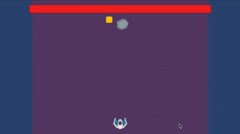

<h1 align="center">Space Shooter</h1>

<h2>Project description</h2>
<b>Space Shooter</b> is a <b>Unity</b> project featuring a simple 2D space shooter game that includes enemy AI, weapon systems, collision detection, and pickup powerups. 

<h2>Features</h2>
<ul>
  <li>Player-controlled spaceship that can move and shoot.</li>
  <li>AI-controlled enemies with randomised movement and autonomous shooting.</li>
  <li>Weapon switching via pickups (machine gun/triple shot).</li>
  <li>Collision-based destruction logic with whitelist/blacklist filtering.</li>
  <li>Modular design using inheritance and interfaces (e.g., WeaponBase, IHealth).</li>
  <li>Health system for player and enemies with on-screen HP bars.</li>
</ul>

<h2>Technologies Used</h2>
🎮 <b>Game Engine:</b> Unity 2022.1.21f1 
🧩 <b>Programming:</b> C# 

<h2>Getting Started</h2>
To get a local copy up and running, follow these simple steps.

<h3>Prerequisites</h3>
<h5>Make sure you have:</h5>
- Unity Hub installed 
- Unity Editor version <b>2022.1.21f1</b> (or compatible)

<h3>Installation</h3>
<h5>Clone the repository:</h5>
https://github.com/Yuliia-Kruta/space-shooter.git

<h3>Open the Project</h3>
<ol>
  <li>Launch Unity Hub</li>
  <li>Click on Add Project</li>
  <li>Select the cloned project folder</li>
  <li>Open the scene named <code>SpaceshipUI</code></li>
</ol>

<h2>How to Play</h2>
- Move the spaceship using <b>Arrow keys</b> or <b>A/D</b>. 
- Shoot with <b>Left Mouse Button</b>. 
- Avoid falling rocks, enemies and bullets. 
- Pick up yellow power-ups to activate <b>Triple Shot</b> temporarily. 
- Pick up green power-ups to increase <b>Health</b>. 

<h2>Copyright Notice</h2>

Copyright (c) 2025 Yuliia Kruta. All rights reserved.

This project is not licensed for reuse, redistribution, or modification without explicit permission from the authors.
